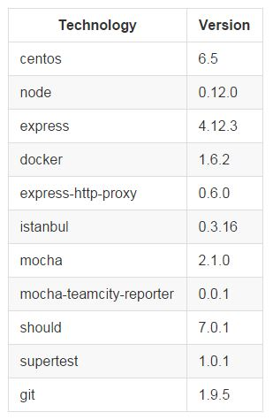

# Gusto
## Public Application Location 
http://ec2-52-27-171-231.us-west-2.compute.amazonaws.com/

## References
**GitHub:** https://github.com/Stratera/gusto

**JIRA:** https://strateratech.atlassian.net

**NPM:** https://www.npmjs.com/package/gusto-stratera

## Overview
Gusto is a Node and Express application which has been delivered to Amazon, running in a Docker container in Production. The Gusto application was written in Node to make use of some of the elegant capabilities of the javascript language. The Express framework was used to extend routes to the node engine, allowing us to both serve RESTful routes and consume RESTful routes in a very consise manor. All of the openfda routes are available through the gusto "/v1/proxy" route by merely appending the openfda to the proxy route.

[Example gusto proxy route](http://ec2-52-27-171-231.us-west-2.compute.amazonaws.com/v1/proxy/drug/event.json?search=patient.drug.openfda.pharm_class_epc:"nonsteroidal+anti-inflammatory+drug"&count=patient.reaction.reactionmeddrapt.exact)

## Implementation

1)
Assigned one leader, gave that person authority and responsibility, and held that person accountable for the quality of the prototype submitted.

[See email](DevelopmentPoolEvidence/team/TechnicalLeadEmail.JPG)

2)
Assembled a multidisciplinary and collaborative team that includes at a minimum of two of the labor categories limited to the Development Pool labor categories.    

Our Team consists of a DevOps Engineer and a Back-end Developer.  Both team members are experienced in the agile scrum development methodology and in playing the role of scrum master.  The DevOps Engineer plays the role of Scrum Master and also performs some of the development tasks.  The Back-end Developer performs the development quality assurance tasks such as peer reviews.

3)
Used at least five modern and open-source technologies, regardless of architectural layer (frontend, backend, etc.)

| Technology | Version |
| ---------- | ------- |
| centos | 6.5 |
| node | 0.12.0 |
| express | 4.12.3 |
| docker | 1.6.2 |
| express-http-proxy | 0.6.0 |
| istanbul | 0.3.16 |
| mocha | 2.1.0 |
| mocha-teamcity-reporter | 0.0.1 |
| should | 7.0.1 |
| supertest | 1.0.1 |
| git |1.9.5 | 

4)
Deployed the prototype on an Infrastructure as a Service (IaaS) or Platform as a Service (PaaS) provider, and indicated which provider they used

The Gusto application is deployed to the Amazon EC2 (IaaS) and is running on t2.micro CentOS 6.5 servers. The delivery of updates to Gusto is being orchestrated by a TeamCity build server which has been established in EC2 and is also being run on a t2.micro server running CentOS 6.5.

Gusto has been made publicly available at the following url:

[http://ec2-52-27-171-231.us-west-2.compute.amazonaws.com/](http://ec2-52-27-171-231.us-west-2.compute.amazonaws.com/)

5) Wrote unit tests for their code.

Unit tests were written in the mocha framework. Istanbul was used for code coverage metric collection and the mocha-teamcity-reporter was used to feed the test results to our teamcity server. We have accomplished 100% code coverage.

[See test-list](DevelopmentPoolEvidence/teamcity/test-list.JPG)

[See code-coverage](DevelopmentPoolEvidence/teamcity/code-coverage.JPG)

[See it all in TeamCity](http://teamcity.strateratech.com:8111/viewLog.html?buildId=105&buildTypeId=Gusto_PreRelease&tab=testsInfo)
(use the guest link to login)

6.) Set up or used a continuous integration system to automate the running of tests and continuously deployed their code to their IaaS or PaaS provider

Our TeamCity server is available [here](http://teamcity.strateratech.com:8111).
(use the guest account link to log in)

TeamCity is actively monitoring all feature branches of the Stratera/Gusto GitHub repo on an ongoing basis. Any commits to any branch will trigger a PreRelease build and unit test execution. Code coverage metrics are collected and all of the test result information is made available in TeamCity. The build result is also provided back to GitHub so that any pull requests are identified as safe or unsafe to merge. 

[See project view](DevelopmentPoolEvidence/teamcity/project-overview.JPG)

[See pull request integration](DevelopmentPoolEvidence/github/pr-teamcity.JPG)

Commits to master automatically package gusto and publish it to npmjs.com. A successful publish job will automatically trigger the Deployment job to Production.

7.) 
Set up or used configuration management

GitHub is used for our source code repository and our code and configuration content is version controlled, peer reviewed, and tracked on a change-by-change basis. We strictly follow the GitHub Flow branch management strategy.

8) 
Set up or used continuous monitoring

Our application and ci servers are being actively monitored in Amazon CloudWatch and will alert our administrator when an problem is identified.

[See monitoring](DevelopmentPoolEvidence/aws/monitoring.JPG)

9.) 
Deploy their software in a container (i.e., utilized operating-system-level virtualization)

The gusto application runs in a Docker container in our Production environment.

10) 
Used an iterative approach, where feedback informed subsequent work or versions of the prototype

The Gusto Development and DevOps teams are both following an agile scrum methodology which has allowed for a fast pace iterative software development environment. Sprint planning, daily stand-ups, retrospectives, and the use of sprints allowed us to quickly identify blockers and prioritize the team's responsibilities. Slack was used for informal collaboration. All of our work was formally managed in Atlassian JIRA.

[Dev Agile Board](DevelopmentPoolEvidence/agile-scrum/Sprint-0-dev.JPG)

[DevOps Agile Board](DevelopmentPoolEvidence/agile-scrum/Sprint-0-devops.JPG)

[Retrospectives](DevelopmentPoolEvidence/agile-scrum/Sprint-0-retrospective.JPG)

11) 
Provided sufficient documentation to install and run their prototype on another machine

[DevelopmentPoolEvidence/Installation.md](DevelopmentPoolEvidence/Installation.md)

12)
Prototype and underlying platforms used to create and run the prototype are openly licensed and free of charge

No technology used requires license or payment for use.